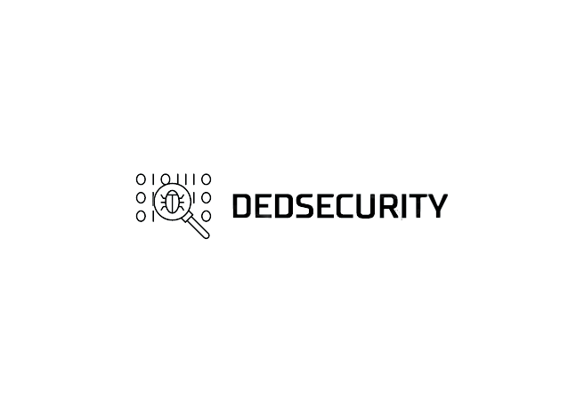
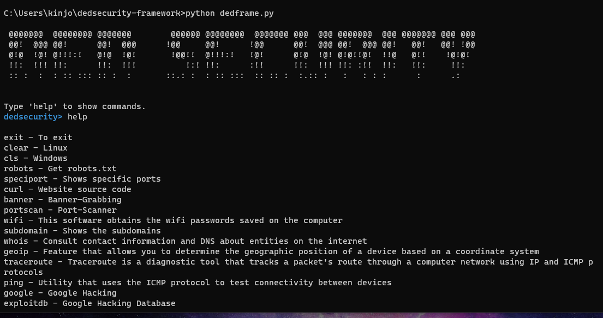

<h1 align="center"></h1>

<h1 align="center">Ded Security Framework</h1>

```bash
Website:  https://www.dedsecurity.com
Author:   Simon Kinjo
Maintenance:  Simon Kinjo
```
>Ded Security Framework is a tool aimed at security professionals
---



## Installation

Make sure you have installed the dependencies:

  * `python` 3
  * `git`
  * `deno`
  * `gcc`

Clone the [source] with `git`:
 ```sh
   git clone https://github.com/dedsecurity/dedsecurity-framework
   cd dedsecurity-framework
   ```

 [source]: https://github.com/dedsecurity/dedsecurity-framework
 
 Use the package manager [pip](https://pip.pypa.io/en/stable/) to install the libraries.

```bash
pip install -r requirements.txt
```
---

```bash
$ chmod +x install.sh
$ ./install.sh
```

## Tools

- Port-scanner

- Banner-grabbing is a technique used to gain information about a computer system on a network and the services running on its open ports. Administrators can use this to take     inventory of the systems and services on their network.

- Exploit-Buffer Overflow

- Remote access for Windows

- Remote access for Linux

- Brute-Force FTP

- Curl

- wifi.py is a software that obtains the wifi passwords saved on the computer

- cat.js shows the contents of the file

- speciport.py shows specific ports

- dedframe.py is the console

- dpc - Real-time semantic code analysis - powered by AI

# Usage remote access
run remotelinux.py or remotewindows.py and then run in the terminal

```bash
nc -l -p 888 -v
```

you have to install the netcat

# Use curl

```bash
deno run --allow-net curl.ts https://google.com
```
you have to install the deno

# Usage cat

```bash
deno run --allow-read cat.ts test.txt
```

# Using specific port

```bash
python speciport.py dedsecurity.com
```
---

## Contributing
Feel free to submitting pull requests to us.
## License
[MIT](https://opensource.org/licenses/MIT)
